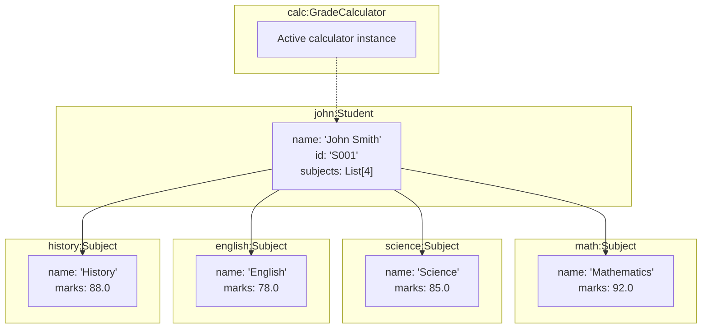

# School Results Application - Object Diagram

```mermaid
graph TD
    subgraph "john:Student"
        A["name: 'John Smith'<br/>id: 'S001'<br/>subjects: List[4]"]
    end
    
    subgraph "math:Subject"
        B["name: 'Mathematics'<br/>marks: 92.0"]
    end
    
    subgraph "science:Subject"
        C["name: 'Science'<br/>marks: 85.0"]
    end
    
    subgraph "english:Subject"
        D["name: 'English'<br/>marks: 78.0"]
    end
    
    subgraph "history:Subject"
        E["name: 'History'<br/>marks: 88.0"]
    end
    
    subgraph "calc:GradeCalculator"
        F["Active calculator instance"]
    end
    
    A --> B
    A --> C
    A --> D
    A --> E
    F -.-> A
```
