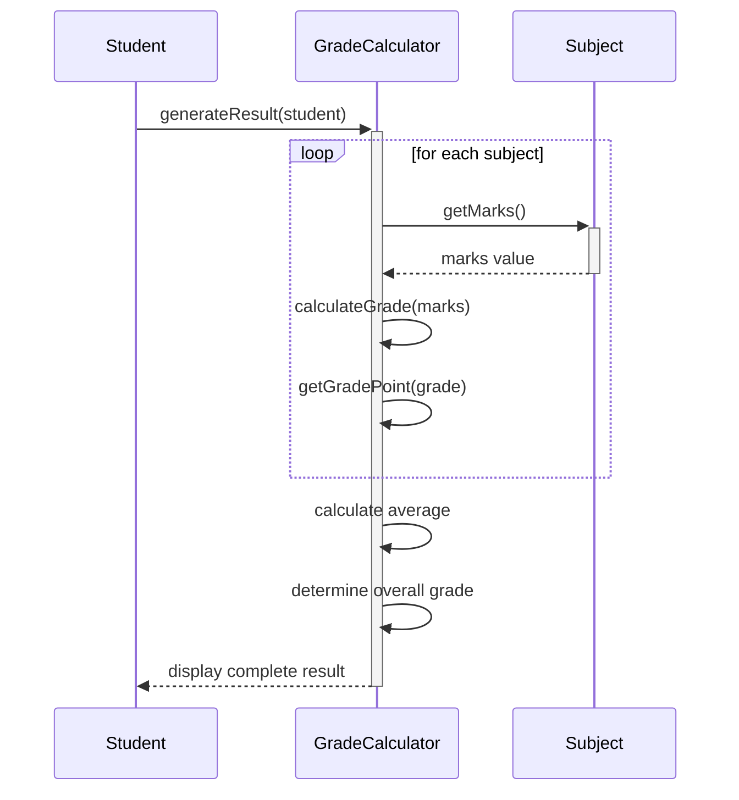

# School Results Application - Sequence Diagram

```mermaid
sequenceDiagram
    participant S as Student
    participant GC as GradeCalculator
    participant Sub as Subject
    
    S->>+GC: generateResult(student)
    loop for each subject
        GC->>+Sub: getMarks()
        Sub-->>-GC: marks value
        GC->>GC: calculateGrade(marks)
        GC->>GC: getGradePoint(grade)
    end
    GC->>GC: calculate average
    GC->>GC: determine overall grade
    GC-->>-S: display complete result
```
